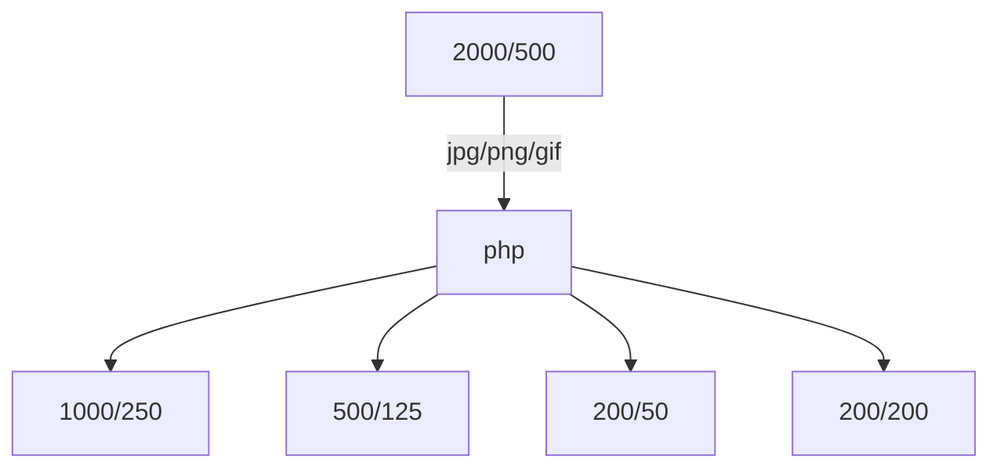
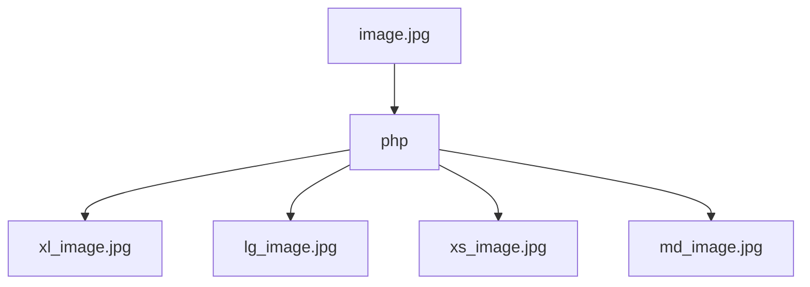

# fonction image php

```mermaid
graph
    2000/500 -->|jpg/png/gif| php
    php --> 1000/250
    php --> 500/125
    php --> 200/50
    php --> 200/200
```

```mermaid
graph
    image.jpg --> php
    php --> xl_image.jpg
    php --> lg_image.jpg
    php --> xs_image.jpg
    php --> md_image.jpg
```

